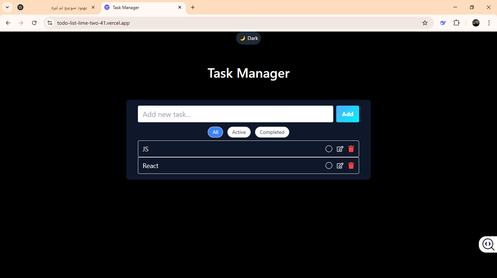
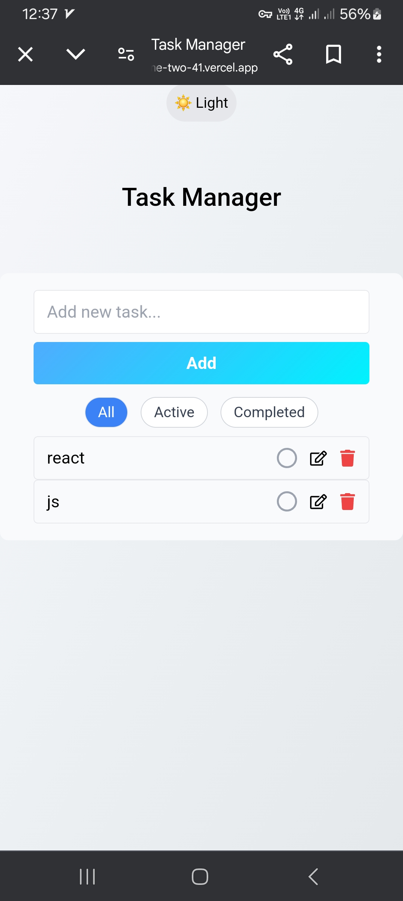

# 📝 Task Manager - To-Do List App

> A simple and responsive to-do list web application built with React, TypeScript, and TailwindCSS.  
> اپلیکیشن تحت وب ساده و واکنش‌گرا برای مدیریت وظایف روزانه، ساخته شده با React، TypeScript و TailwindCSS.

## 🌟 Features | ویژگی‌ها

- ✅ Add new tasks | افزودن وظایف جدید
- 🗑️ Delete tasks | حذف وظایف
- ✏️ Edit tasks | ویرایش وظایف
- 🌈 Responsive design | طراحی واکنش‌گرا (ریسپانسیو)
- ☁️ Deployed on Vercel | مستقر شده روی Vercel

## 🚀 Live Demo | نسخه آنلاین

🔗 [View Live Project on Vercel](https://todo-list-lime-two-41.vercel.app/)

## 🛠️ Installation | نصب و اجرا

1. Clone the repository:

   ```bash
   git clone https://github.com/Erf92/todo-list.git

   ```

2. Navigate to the project directory:
   cd todo-list

3. Install dependencies:
   npm install

4. Run the development server:
   npm run dev

## 📸 Screenshots | اسکرین‌شات‌ها

| Desktop                                          | Mobile                                         |
| ------------------------------------------------ | ---------------------------------------------- |
|  |  |

## 📂 Technologies Used | تکنولوژی‌های استفاده‌شده

- React

- TypeScript

- TailwindCSS

- Vite

- Vercel

## 📌 Author | نویسنده

- GitHub: @Erf92

- Email: erf92raj@gmail.com
